# Desktop CNC Milling: End-to-End Workflow SOP

This document outlines the proven process for safely executing CNC routing jobs on a **Genmitsu 3018-PROVer V2** (GRBL) platform, calibrated for single-flute upcut micro-tooling in Medium-Density Fiberboard (MDF).

## 1. Hardware & Tooling Profile
* **Machine:** Genmitsu 3018-PROVer V2 (Max travel: 300x180x45mm, equipped with limit switches and physical E-Stop)
* **Spindle:** 775 DC Brushed Motor (24V)
* **Tool:** HQMaster 2mm Single Flute Upcut (O-Flute) Solid Tungsten Carbide 
  * *Tool Characteristics:* Upcut flutes aggressively extract dust to prevent heat buildup. Requires higher feed rates for proper chip load. Upcut geometry naturally pulls top fibers, causing surface fuzz on MDF.
* **Workpiece:** 3/4" MDF
* **Software Stack:** Inkscape (Vector) > Kiri:Moto (CAM) > CNCjs (Sender)

---

## 2. Phase 1: Vector Validation & Design (Inkscape)

### The 2.1mm "Physical Kerf" Simulation
Mathematically prove the 2mm bit physically fits inside your geometry to prevent CAM from generating self-intersecting toolpaths.
1. Select the entire design (`Ctrl+A`).
2. Open Fill and Stroke (`Ctrl+Shift+F`). Remove solid fills (`No paint`).
3. Apply a solid **Stroke color** and set width to **2.1 mm**.
4. **Verify:** Zoom in on tight internal loops (e.g., "e", "a"). If stroke lines pinch shut, stack the text, enlarge the design, or switch to a V-bit.

### Boundary Constraints & Export
* Scale the design to a maximum width of **280mm** (leaving a 10mm safety margin).
* Convert all text to vectors (`Path > Object to Path`).
* Save as a **Plain SVG**.

---

## 3. Phase 2: CAM Toolpaths & Deep Evaluation (Kiri:Moto)

Double-check these parameters to prevent catastrophic machine dives or tool breakage:
* **Unit Verification:** Confirm the workspace is strictly set to **Metric (mm)**. A 1.5-inch dive instead of 1.5mm will instantly crash the PROVer V2.
* **Step Down:** `0.5 mm`. Never force deep single passes on micro-tooling.
* **Target Depth:** `1.5 mm` (Total of 3 passes).
* **Clearance / Safe Z:** Ensure the retract height is `10.0 mm` so the bit clears clamps during rapid travel.
* **Feed Rate:** `600–800 mm/min` (Optimized for single-flute O-Flute in MDF).
* **Plunge Rate:** `100 mm/min`.
* **Z-Bottom Override:** Leave **blank**. Manual overrides conflict with target depths.
* **Verification:** Generate the preview. Visually count the 3 distinct cut layers. Export the `.nc` file.

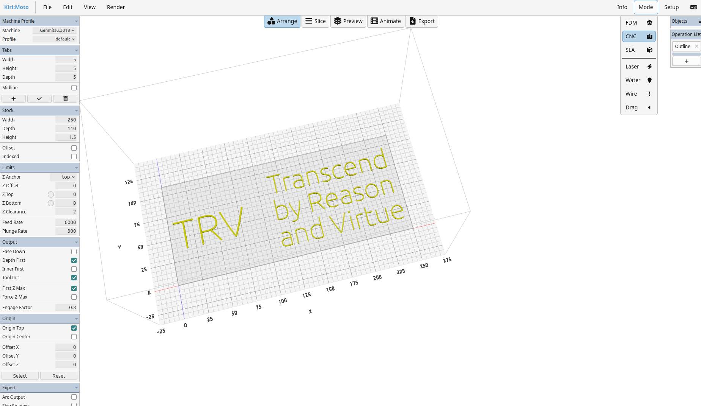
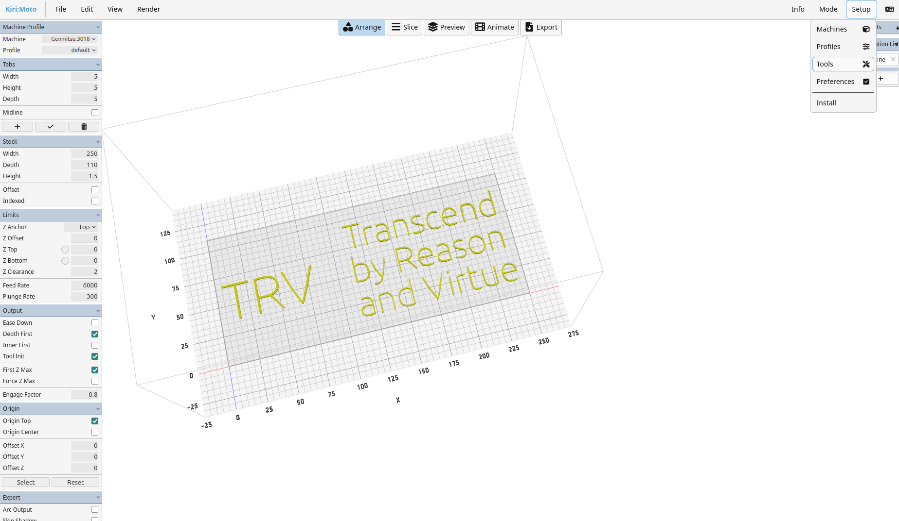
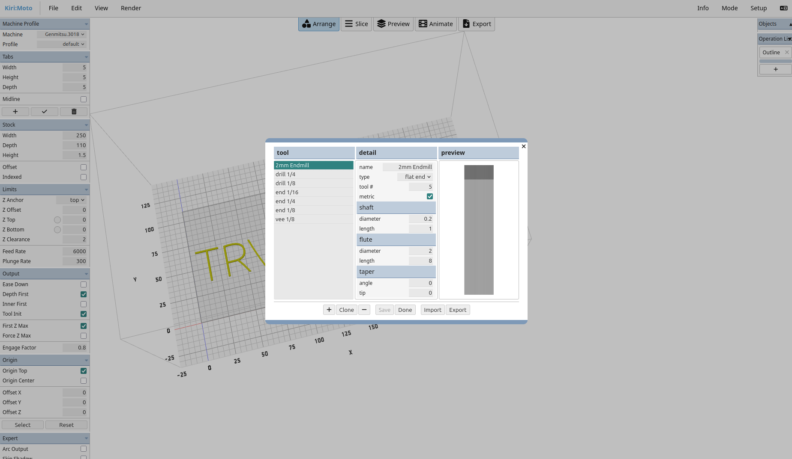
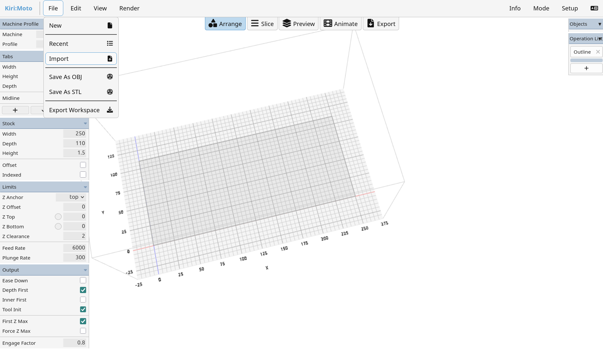
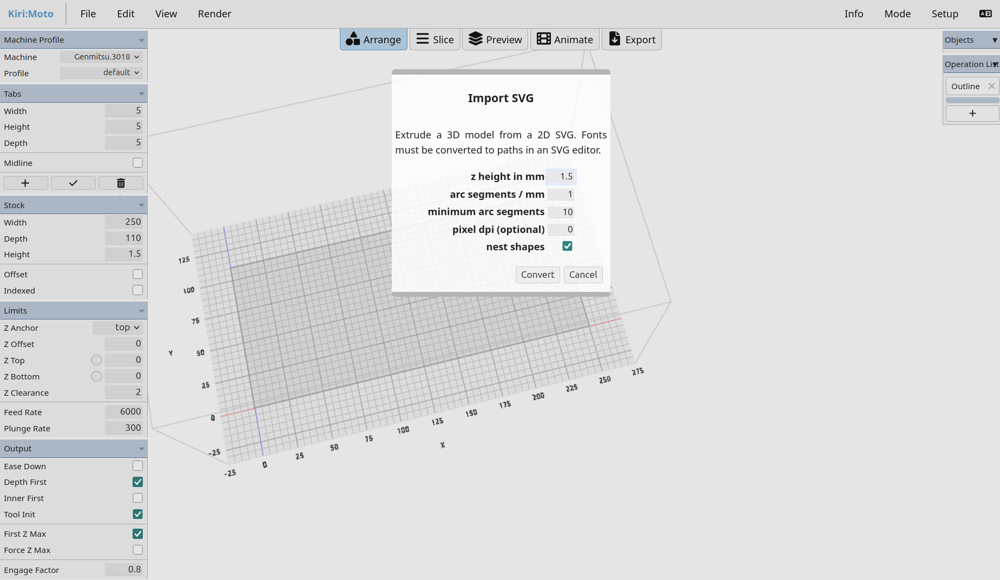
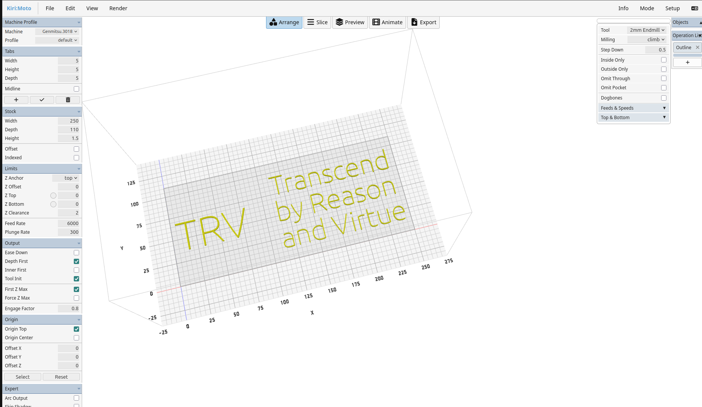
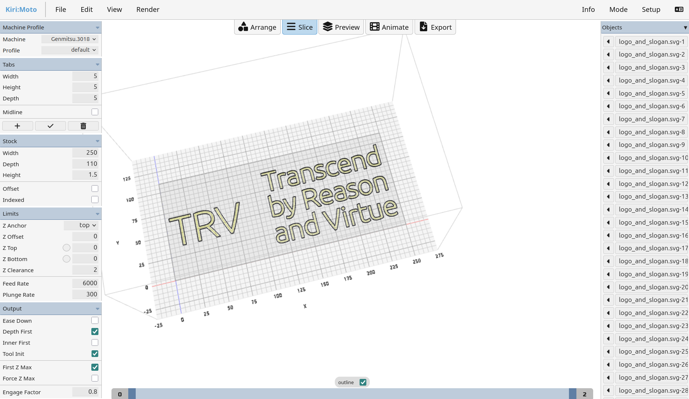
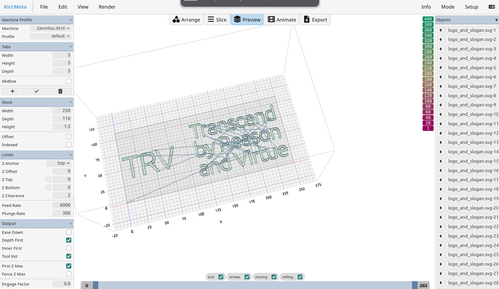
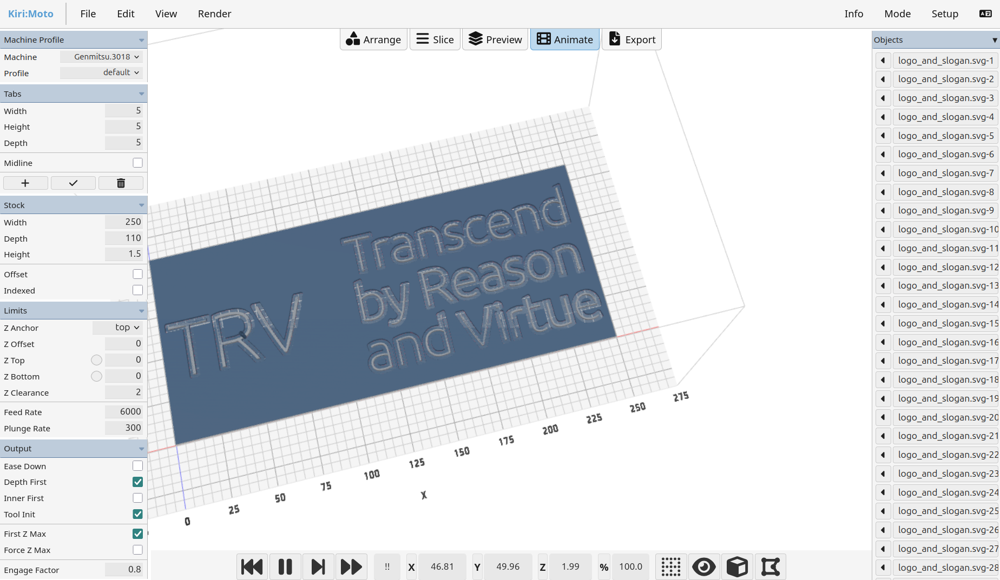
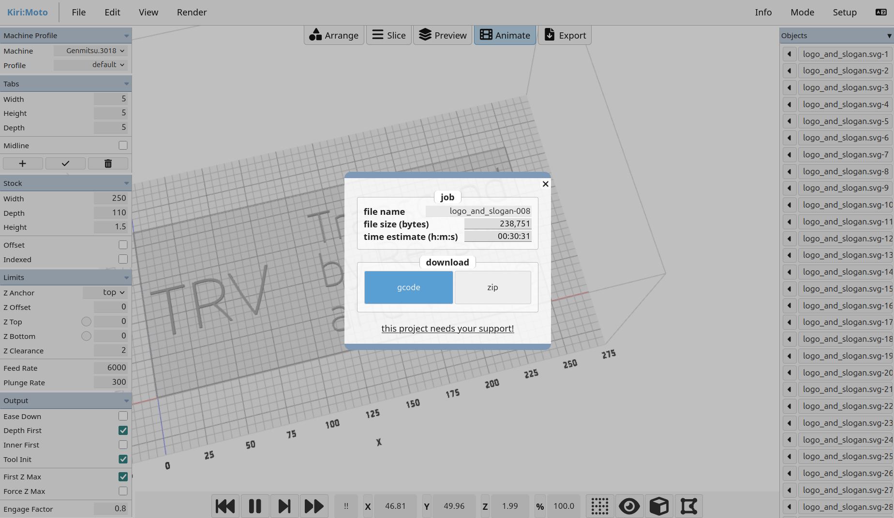

---

## 4. Phase 3: Setup & Zeroing (CNCjs)

### Clamping & Safe Zones
Clamp the MDF strictly on the extreme outer edges. Ensure the PROVer V2's limit switches are clear of debris so they can successfully trigger if the machine over-travels.

### The Zeroing Protocol
1. **X/Y Origin:** Jog the bit to the bottom-left corner. Click the zero/map-pin icons for X and Y in CNCjs.
2. **Z Origin (Paper Trick):** Place printer paper beneath the bit. Set jog increments to `0.1 mm`. Step down until the bit slightly grips the paper. Zero the Z-axis.
3. **Safety Retract:** Change the jog increment to `10 mm` and lift the Z-axis. **Never start the spindle while touching the wood.**

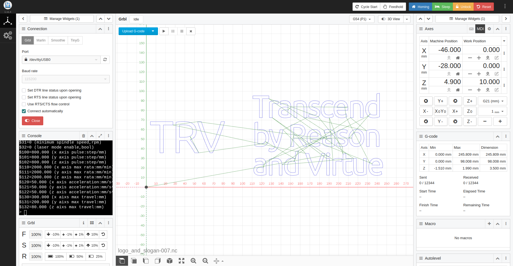
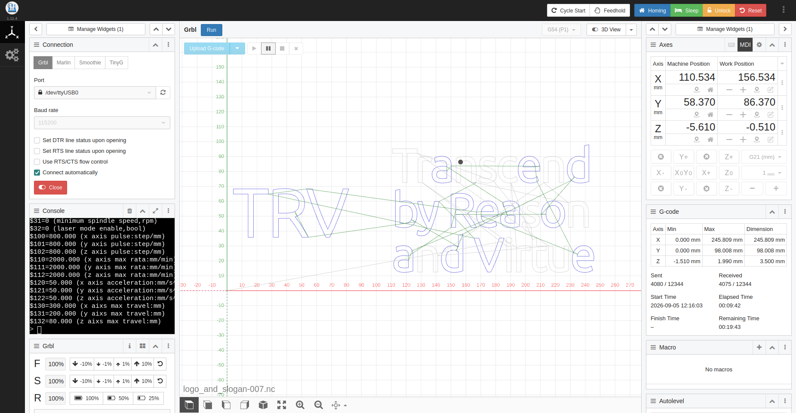

---

## 5. Phase 4: Pre-Flight Safety & Execution

### 5-Point Safety Audit (Do this before hitting Play)
1. **PPE:** Safety glasses are physically on your face.
2. **Collet Check:** Take your two wrenches and physically verify the collet nut is fully tightened. Machine vibration will pull a loose bit downward, ruining the zero and gouging the spoilboard.
3. **E-Stop Readiness:** Locate the PROVer V2's physical red E-Stop button. Ensure it is unlocked (twisted clockwise) and your hand can easily reach it.
4. **Code Audit:** In CNCjs, verify `Z Min` strictly reads `-1.510 mm`. 
5. **Clearance:** Cables and hoses have full slack and will not catch on the moving gantry.

### Clearing GRBL Holds & Connection Freezes
* **Orange "Hold" State:** Click **Cycle Start** (the `~` button top-right) to return to **Idle**.
* **Soft Reset:** If the machine freezes, click **Reset**, then **Unlock**, re-upload the `.nc` file, and hit Play.

---

## 6. Phase 5: Post-Processing & Cleanup

### Safe Dust Extraction
* **Static Hazard:** Do NOT use a plastic vacuum wand near the spinning spindle. Static buildup will arc to the aluminum frame and short the USB connection.
* Wait 1-2 minutes for airborne dust to settle.
* Jog the bit up and away, power off the PROVer V2 controller, and extract the workpiece.

### Surface Finishing
1. Take the board outside and blow out the heavy debris from the 1.5mm channels.
2. Scrub the surface and the inside of the letters with a stiff dry toothbrush or Scotch-Brite pad to shear off the remaining MDF fuzz.

---

## 7. Lifecycle & Maintenance
* **Tool Disposal:** Solid tungsten carbide is scrap metal. Collect dull bits in a jar for scrap recycling (or discard if you so choose to do so).
* **Lubrication:** Every 10-20 hours, apply **Dry PTFE Lube** to the threaded lead screws and smooth guide rods.
* **Fasteners:** Periodically check and tighten the grub screws on the motor couplers to prevent axis slipping.

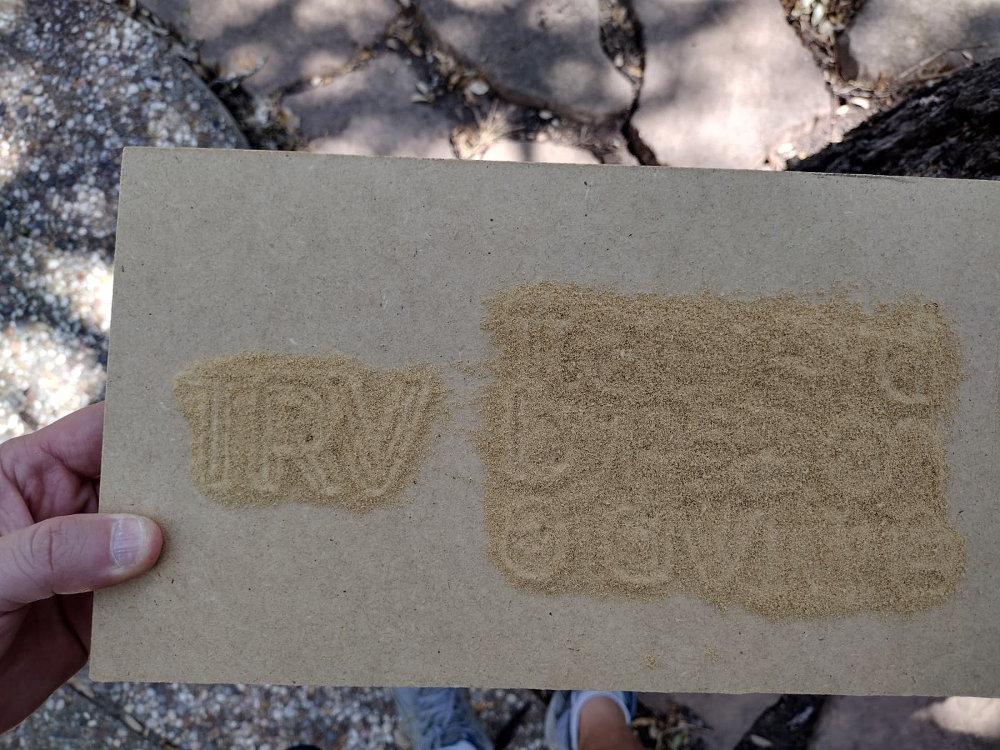
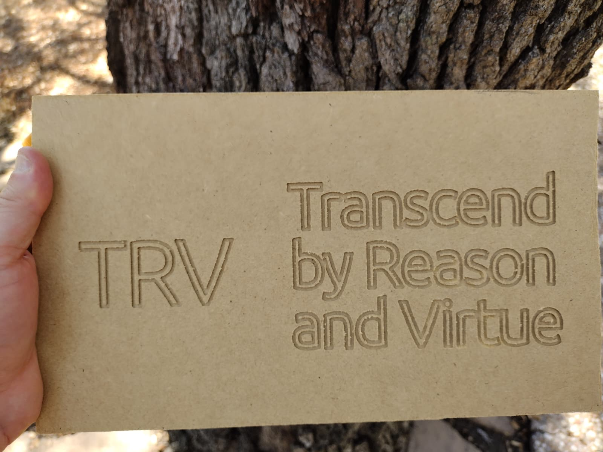
